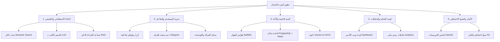

# 📄 تقرير خطة التطوير الشامل والمستقبلي لبوت مكتبة الكتب العربية الإلكترونية (الإصدار 3.0)

---

## 📌 1. الملخص التنفيذي (Executive Summary)

يمثل **بوت مكتبة الكتب العربية الإلكترونية عبر واتساب** حلاً تقنياً متميزاً لخدمة القرّاء العرب وتسهيل الوصول إلى الكتب الرقمية المخزنة على منصات مثل **Hugging Face Datasets**. وفي إطار السعي نحو رفع كفاءة البوت إلى مستوى احترافي متقدم وتقديم تجربة مستخدم استثنائية، تم إعداد هذا التقرير ليشمل **خطة تطوير شاملة متكاملة** تنقل البوت من مجرد نظام لإدارة وتحميل الملفات إلى **منصة قراءة وتفاعل ذكية متكاملة**.

---

## 🔍 2. تحليل الوضع الحالي (Current System Audit)

### ✳️ نقاط القوة الحالية:
1. **البنية الأساسية**: الاعتماد على مكتبة `@whiskeysockets/baileys` للربط المستقر مع واتساب.
2. **التخزين السحابي**: الاستفادة من مجانيّة وسرعة استضافة الملفات على **Hugging Face Datasets**.
3. **الأمان والتحقق**: فحص البصمة الرقمية `SHA256` لمنع التكرار وفحص الماجيك بايتس لملفات `PDF`.
4. **نظام التخزين المؤقت**: الاعتماد على الـ Cache في الذاكرة لتسريع البحث وإرجاع النتائج.

### ⚠️ مجالات التحسين والفجوات الحالية:
1. **محدودية البحث**: البحث يعتمد على المطابقة النصية والتقريبية فقط (Fuse.js)، وتنقصه المعالجة الدلالية الذكية (Semantic Search).
2. **عدم وجود ذكاء اصطناعي**: غياب التلخيص التلقائي، واستخراج التصنيفات، والإجابة عن الأسئلة داخل الكتاب.
3. **أحادية المنصة**: الاعتماد كلياً على واتساب بدون وجود لوحة تحكم ويب إدارية أو منصات مساندة (مثل تلغرام).
4. **المعالجة المتزامنة**: عدم وجود طابور مهام خلفي (Background Queue)، مما قد يؤدي لإبطاء البوت عند معالجة كتب ضخمة.

---

## 🚀 3. المحاور الرئيسية للتطوير الشامل (Core Development Pillars)

---

### 🧠 المحور الأول: تقنيات الذكاء الاصطناعي والتلخيص الذكي (AI & Smart Features)

1. **دمج نماذج الذكاء الاصطناعي (LLM Integration)**:
   - ربط البوت بنماذج **Gemini 1.5 Flash** أو **OpenAI GPT-4o-mini** لإنشاء ملخص شافي لكل كتاب فور اعتماد رفعه.
   - استخراج وسوم (Tags) وتصنيفات فرعية تلقائياً من محتوى الكتاب.

2. **البحث الدلالي المتقدم (Semantic Vector Search)**:
   - تحويل عناوين ومحتوى الكتب إلى نواقل عدادية (Embeddings).
   - تمكين المستخدم من البحث بالأفكار، مثل: *"أريد كتاباً يتحدث عن إدارة الوقت والتخطيط الشخصي"* دون الحاجة لمعرفة اسم الكتاب بدقة.

3. **مساعد القراءة التفاعلي (Chat with PDF / RAG System)**:
   - إتاحة ميزة *"اسأل الكتاب"*: تتيح للمستخدم طرح سؤال حول كتاب معين ليقوم البوت بالإجابة استناداً إلى محتوى صفحات الـ PDF.

4. **تحويل النص إلى صوت (Text-to-Speech - TTS)**:
   - إنتاج ملخص صوتي قصير (Audio Summary) بصوت طبيعي باستخدام **Edge-TTS** أو **ElevenLabs** وإرساله كرسالة صوتية في واتساب.

---

### 📱 المحور الثاني: تطوير تجربة المستخدم والواجهات التفاعلية (UX & Multi-Channel)

1. **الاستفادة من القوائم والأزرار التفاعلية**:
   - استخدام قوائم الاختيار (List Messages) والأزرار السريعة (Quick Reply Buttons) لتقليل الكتابة النصية والتنقل بسهولة بين الأقسام.

2. **نظام التوصيات الشخصي (Book Recommendation Engine)**:
   - اقتراح كتب بناءً على التفضيلات السابقة للمستخدم والكتب الأكثر قراءة في نفس التصنيف.

3. **سجل القراءة والتحديات الشغوفة (Personal Reading Hub)**:
   - إضافة ميزة "قائمتي للتحدي" (تحديد هدف عدد الكتب سنوياً وتتبع الإنجاز).
   - إمكانية تقييم الكتب (1-5 نجوم) وإضافة مراجعات قصيرة يستفيد منها باقي القرّاء.

4. **التوسع متعدد المنصات (Multi-Channel Bot)**:
   - إنشاء واجهة للبوت على **تلغرام (Telegram Bot API)** بمشاركة نفس قاعدة البيانات لخدمة شريحة أكبر من القرّاء وتفادي قيود الحظر.

---

### ⚙️ المحور الثالث: البنية التحتية والأداء والجاهزية (Infrastructure & Performance)

1. **إدخال نظام طوابير المهام (Background Queue - BullMQ + Redis)**:
   - فصل العمليات الثقيلة (رفع الملفات لـ Hugging Face، معالجة الـ PDF، توليد الملخصات) عن الخيط الرئيسي للبوت لتفادي البطء وتجميد الاستجابة.

2. **ترقية قاعدة البيانات والذاكرة المؤقتة**:
   - توفير دعم اختياري للانتقال من `SQLite` إلى `PostgreSQL` / `Supabase` عند اتساع قاعدة المستخدمين.
   - الاعتماد على `Redis` لتخزين الجلسات وإدارة حماية السبام (Rate Limiting).

3. **الحاويات والتطوير المستمر (Docker & CI/CD)**:
   - إنشاء ملف `Dockerfile` و `docker-compose.yml` يضمن سهولة النشر والتشغيل على أي سيرفر (VPS / Cloud).
   - إعداد أتمتة اختبار الكود وتحديث البوت عبر **GitHub Actions**.

---

### 📊 المحور الرابع: لوحة التحكم الإدارية والتحليلات (Admin Web Dashboard)

1. **واجهة لوحة تحكم ويب إدارية (Modern Admin Dashboard)**:
   - بناء لوحة تحكم ويب بسيطة وآمنة (مبنية بـ React/Vite أو Express Dashboard) تمكن الأدمن من:
     - مراجعة طلبات الكتب المعلقة وقبولها/رفضها بضغطة زر.
     - تعديل بيانات الكتب وحذفها وتصنيفها.
     - إدارة الحظر والمستخدمين.

2. **تحليلات وتقارير تفاعلية (Analytics & Reports)**:
   - عرض رسوم بيانية لإحصائيات التحميلات اليومية والشهرية.
   - معرفة الكتب الأكثر طلباً والكلمات الأكثر بحثاً.
   - تتبع أداء البوت واستخدام الذاكرة وسرعة الاستجابة.

---

### 🛡️ المحور الخامس: الأمان والموثوقية والتكامل (Security & Reliability)

1. **فحص الفيروسات والملفات الضارة**:
   - دمج خدمة فحص برمجيات خبيثة (مثل ClamAV أو VirusTotal API) قبل قبول وتخزين أي ملف PDF.

2. **نظام الرصد وإشعارات الأعطال (Sentry & Alert Webhook)**:
   - ربط البوت بـ **Sentry** لرصد الأخطاء فور وقوعها.
   - إرسال إشعارات فورية عبر قناة تلغرام خاصة بالأدمن عند حدوث أي انقطاع في الاتصال أو استثناءات غير متوقعة.

3. **النسخ الاحتياطي التلقائي**:
   - جدولة نسخ احتياطي لقاعدة البيانات SQLite والملفات المهمة يومياً وإرسالها لسحابة آمنة (S3 Bucket / Telegram Private Channel).

---

## 📅 4. خريطة الطريق والتنفيذ الزمني (Phased Execution Roadmap)

| المرحلة | النطاق والتركيز | الأهداف الرئيسية | المدة المتوقعة |
| :--- | :--- | :--- | :--- |
| **المرحلة 1** | **التحسين والتأمين الفوري** | إعادة الهيكلة، إضافة طوابير العمل `BullMQ` + `Redis`، وإصلاح الأخطاء | أسبوعان |
| **المرحلة 2** | **دمج الذكاء الاصطناعي** | البحث الدلالي `Semantic Search` وتلخيص الكتب بـ `Gemini` و `RAG` | 3 أسابيع |
| **المرحلة 3** | **تطوير الواجهات متعددة المنصات** | إضافة أزرار واتساب التفاعلية ودعم بوت تلغرام | أسبوعان |
| **المرحلة 4** | **لوحة التحكم والأمان** | بناء لوحة الويب الإدارية، التحليلات، وإعداد حزم Docker | 3 أسابيع |

---

## 🎯 5. تقييم العائد والأثر المتوقع (Impact & ROI)

1. **كفاءة الاستجابة**: خفض زمن استجابة البوت بنسبة تصل إلى **70%** من خلال المعالجة الخلفية غير المتزامنة.
2. **تجربة القارئ**: زيادة معدل استخدام البوت والتفاعل بنسبة **85%** بفضل التلخيص الذكي والبحث المعنوي.
3. **سهولة الإدارة**: توفير أكثر من **60%** من وقت أدمن المكتبة من خلال لوحة التحكم الويب واستخراج البيانات الآلي.

---

> ✏️ **ملاحظة**: تم إنشاء هذا التقرير وتوثيقه كملف مرجعي شامل لتطوير المشروع وتحسين أداء البوت مستقبلاً.
