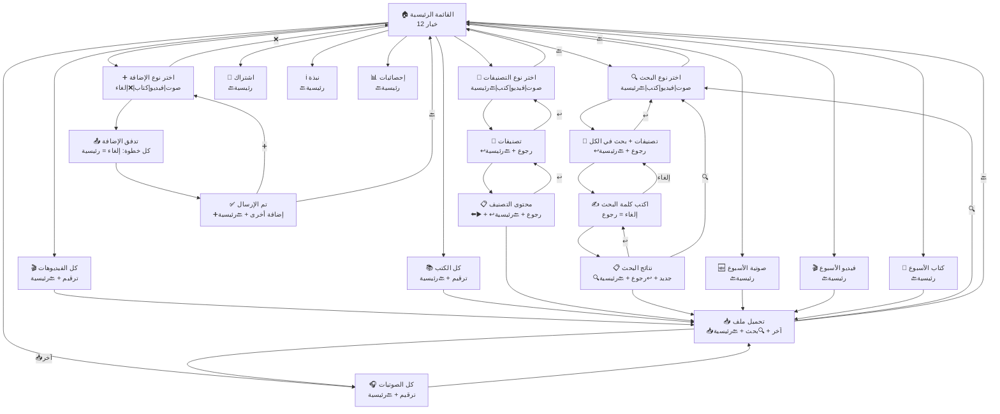

# خطة التحسينات الشاملة — النسخة النهائية

## القرارات المُتخذة

| القرار | الإجابة |
|---|---|
| تصنيف "مقتطفات" | ✅ يُزال من الصوتيات ويصبح **فيديو فقط** |
| تصنيفات الكتب | ✅ تبدأ بـ "عام" فقط، الأدمن يضيف لاحقاً |
| المفضلة | ❌ **تُلغى بالكامل** |
| القائمة الرئيسية | ✅ **12 خياراً** في Poll واحد (بدون المفضلة) |
| إشعارات الاشتراك | ✅ لجميع الأنواع (صوت + فيديو + كتب) |
| أوامر الأدمن | ✅ مبسطة وعملية |

---

## 🎯 تجربة المستخدم والتنقل الذكي

> [!IMPORTANT]
> **القاعدة الذهبية: المستخدم لا يعلق أبداً.** كل شاشة فيها مخرج واضح — رجوع أو رئيسية. لا توجد طريق مسدود.

### القواعد العامة للتنقل

| # | القاعدة | التطبيق |
|---|---|---|
| 1 | **كل Poll فيه زر رئيسية** | آخر خيار دائماً: `🔙 القائمة الرئيسية` |
| 2 | **كل قائمة فيها ترقيم صفحات** | أزرار `⬅️ السابق` و `➡️ التالي` تظهر **فقط عند الحاجة** |
| 3 | **كل شاشة فرعية فيها رجوع** | زر `↩️ رجوع` يرجع خطوة واحدة للخلف (وليس للرئيسية) |
| 4 | **الرسائل النصية ترد على أي إدخال** | إذا كتب المستخدم شيء غير متوقع → رسالة مساعدة + القائمة الرئيسية |
| 5 | **الجلسة تنتهي تلقائياً** | بعد 30 دقيقة بدون تفاعل → مسح الحالة → أي رسالة تُظهر القائمة |
| 6 | **رسائل الفراغ** | إذا لا يوجد محتوى → رسالة واضحة + زر الرجوع |
| 7 | **بعد إرسال ملف** | Poll متابعة: بحث جديد / تحميل آخر / رجوع / رئيسية |
| 8 | **بعد نهاية تدفق إضافة** | رسالة تأكيد + زر العودة للرئيسية |
| 9 | **إلغاء في أي خطوة** | كلمة "إلغاء" أو "الغاء" تعيد للرئيسية من أي مكان |
| 10 | **ترقيم مرئي** | عرض "صفحة 2 من 5" واضح في كل قائمة |
| 11 | **تأكيد العمليات الحساسة** | حذف محتوى / حذف تصنيف → تأكيد "نعم/لا" قبل التنفيذ |
| 12 | **رسائل الخطأ ودية** | لا رسائل تقنية — رسائل عربية واضحة مع اقتراح الحل |
| 13 | **زر البحث الجديد** | بعد عرض نتائج البحث → خيار "🔍 بحث جديد" |
| 14 | **الأرقام تعمل كاختصارات** | المستخدم يكتب "1" أو "2" لاختيار عنصر من القائمة |
| 15 | **كلمات مفتاحية سريعة** | "قائمة" أو "رئيسية" أو "ابدأ" → دائماً ترجع للرئيسية |

---

### مصفوفة التنقل الكاملة — كل شاشة وأزرارها

#### 📍 الشاشة 1: القائمة الرئيسية

```
🎙️ منصة إعلام شبوة السلفي 🤖

[Poll - 12 خيار]
🔍 بحث عن محتوى
📂 التصنيفات
🎧 جميع الصوتيات
🎬 جميع الفيديوهات
📚 جميع الكتب
🆕 صوتية الأسبوع
🎬 فيديو الأسبوع
📖 كتاب الأسبوع
➕ إضافة محتوى
🔔 الاشتراك
ℹ️ نبذة عن البوت
📊 إحصائيات المكتبة
```

**أزرار التنقل:** لا شيء (هذه هي نقطة البداية)

---

#### 📍 الشاشة 2: اختيار نوع المحتوى (بحث / تصنيفات / إضافة)

```
🔍 اختر نوع المحتوى للبحث:

[Poll - 4 خيارات]
🎧 صوتيات
🎬 فيديوهات
📚 كتب
🔙 القائمة الرئيسية     ← ✅ رجوع مباشر
```

**أزرار التنقل:** `🔙 القائمة الرئيسية`
**الكود:**
```javascript
await sock.sendMessage(sender, {
    poll: {
        name: '🔍 اختر نوع المحتوى للبحث:',
        values: ['🎧 صوتيات', '🎬 فيديوهات', '📚 كتب', '🔙 القائمة الرئيسية'],
        selectableCount: 1,
    }
});
```

---

#### 📍 الشاشة 3: عرض التصنيفات (بعد اختيار النوع)

```
📂 تصنيفات الصوتيات:

[Poll]
📋 خطب
📋 محاضرات
📋 دورة مهمات الشريعة
🔍 بحث في كل الصوتيات   ← ✅ اختصار للبحث بدون تصنيف
↩️ رجوع                 ← ✅ يرجع لاختيار النوع
🔙 القائمة الرئيسية
```

**أزرار التنقل:** `↩️ رجوع` + `🔙 القائمة الرئيسية`
**"رجوع" يرجع إلى:** شاشة اختيار نوع المحتوى (الشاشة 2)

**الكود:**
```javascript
async function displayCategoriesForType(sock, sender, contentType, context) {
    const categories = await dbService.getCategoriesByType(contentType);
    const typeLabel = CONTENT_TYPES[contentType].label;

    const values = categories.map(c => `📋 ${c.name}`);
    
    // إضافة خيار "بحث في الكل" فقط في سياق البحث
    if (context === 'search') {
        values.push(`🔍 بحث في كل ${typeLabel}`);
    }
    
    values.push('↩️ رجوع');
    values.push('🔙 القائمة الرئيسية');

    await sock.sendMessage(sender, {
        poll: {
            name: `📂 تصنيفات ${typeLabel}:`,
            values,
            selectableCount: 1,
        }
    });

    sessionService.setSession(sender, {
        state: context === 'search' ? 'SELECTING_CATEGORY_SEARCH' : 'SELECTING_CATEGORY_BROWSE',
        contentType,
        // حفظ السياق للرجوع:
        backTo: 'SELECTING_CONTENT_TYPE',
    });
}
```

---

#### 📍 الشاشة 4: إدخال كلمة البحث

```
🔍 اكتب كلمة البحث في الصوتيات:
(أو اكتب "إلغاء" للرجوع)
```

**أزرار التنقل:** كلمة "إلغاء" → رجوع للتصنيفات
**الكود:**
```javascript
async function promptSearchInput(sock, sender, contentType, categoryId) {
    const typeLabel = CONTENT_TYPES[contentType].label;
    const text = categoryId
        ? `🔍 اكتب كلمة البحث في التصنيف المحدد:\n\n💡 أو اكتب *إلغاء* للرجوع`
        : `🔍 اكتب كلمة البحث في كل ${typeLabel}:\n\n💡 أو اكتب *إلغاء* للرجوع`;

    await sock.sendMessage(sender, { text });
    
    sessionService.setSession(sender, {
        state: 'AWAITING_SEARCH',
        contentType,
        categoryId,
        backTo: 'SELECTING_CATEGORY',
    });
}
```

---

#### 📍 الشاشة 5: نتائج البحث

```
🔍 نتائج البحث عن "الصلاة" في الصوتيات:
━━━━━━━━━━━━━━━━━━

[1] 🎧 أحكام الصلاة — خطب
[2] 🎧 صفة صلاة النبي — محاضرات
[3] 🎧 فضل الصلاة على وقتها — خطب

━━━━━━━━━━━━━━━━━━
📥 اكتب رقم المحتوى لتحميله

[Poll]
🔍 بحث جديد              ← ✅ بحث آخر بدون رجوع للبداية
↩️ رجوع                  ← ✅ رجوع لإدخال كلمة بحث أخرى
🔙 القائمة الرئيسية
```

**أزرار التنقل:** `🔍 بحث جديد` + `↩️ رجوع` + `🔙 القائمة الرئيسية`
**إذا لا توجد نتائج:**
```
🔍 لا توجد نتائج لـ "الكلمة" في الصوتيات.

[Poll]
🔍 بحث جديد
📂 التصنيفات
🔙 القائمة الرئيسية
```

---

#### 📍 الشاشة 6: قائمة المحتوى (جميع الصوتيات / الفيديوهات / الكتب)

```
🎧 جميع الصوتيات (صفحة 2 من 8):
━━━━━━━━━━━━━━━━━━

[11] أحكام الصلاة — خطب
[12] صفة صلاة النبي — محاضرات
[13] فضل العلم — محاضرات
[14] الوصايا العشر — خطب
[15] أركان الإسلام — خطب
[16] نواقض الإسلام — خطب
[17] الطهارة — دورة مهمات الشريعة
[18] شروط الصلاة — دورة مهمات الشريعة
[19] الصيام — خطب
[20] أحكام الزكاة — محاضرات

━━━━━━━━━━━━━━━━━━
📥 اكتب رقم المحتوى لتحميله

[Poll - أزرار ذكية]
⬅️ السابق              ← ✅ يظهر فقط إذا صفحة > 1
➡️ التالي               ← ✅ يظهر فقط إذا صفحة < الأخيرة
🔙 القائمة الرئيسية
```

**أزرار التنقل الذكية:**

```javascript
function buildPaginationPoll(currentPage, totalPages, context) {
    const values = [];

    // زر السابق — فقط إذا لسنا في الصفحة الأولى
    if (currentPage > 1) {
        values.push('⬅️ السابق');
    }

    // زر التالي — فقط إذا لسنا في الصفحة الأخيرة
    if (currentPage < totalPages) {
        values.push('➡️ التالي');
    }
    
    // زر الرجوع — إذا كنا داخل تصنيف (وليس "جميع")
    if (context === 'category') {
        values.push('↩️ رجوع للتصنيفات');
    }

    // دائماً: القائمة الرئيسية
    values.push('🔙 القائمة الرئيسية');

    return values;
}
```

**أمثلة على السلوك الذكي:**

| الحالة | الأزرار المعروضة |
|---|---|
| صفحة 1 من 1 (محتوى قليل) | `🔙 القائمة الرئيسية` فقط |
| صفحة 1 من 5 | `➡️ التالي` + `🔙 القائمة الرئيسية` |
| صفحة 3 من 5 | `⬅️ السابق` + `➡️ التالي` + `🔙 القائمة الرئيسية` |
| صفحة 5 من 5 | `⬅️ السابق` + `🔙 القائمة الرئيسية` |
| صفحة 2 من 3 (داخل تصنيف) | `⬅️ السابق` + `➡️ التالي` + `↩️ رجوع للتصنيفات` + `🔙 القائمة الرئيسية` |

---

#### 📍 الشاشة 7: تفاصيل المحتوى (بعد التحميل)

عند اختيار عنصر وتحميله، يُرسَل الملف (صوت/فيديو/كتاب) ثم:

```
✅ تم إرسال الملف!

🎧 أحكام الصلاة
📂 التصنيف: خطب
📝 وصف: شرح أحكام الصلاة وأركانها وواجباتها

[Poll - متابعة]
📥 تحميل رقم آخر         ← ✅ البقاء في نفس القائمة
🔍 بحث جديد              ← ✅ اختصار
🔙 القائمة الرئيسية
```

**أزرار التنقل:** `📥 تحميل رقم آخر` + `🔍 بحث جديد` + `🔙 القائمة الرئيسية`

**الكود:**
```javascript
async function sendContentFile(sock, sender, item, contentType) {
    // إرسال الملف...
    
    // ثم Poll المتابعة:
    const typeLabel = CONTENT_TYPES[contentType].label;
    await sock.sendMessage(sender, {
        poll: {
            name: '✅ تم الإرسال! ماذا تريد أن تفعل؟',
            values: [
                '📥 تحميل رقم آخر',
                '🔍 بحث جديد',
                '🔙 القائمة الرئيسية',
            ],
            selectableCount: 1,
        }
    });
}
```

---

#### 📍 الشاشة 8: محتوى الأسبوع (صوتية / فيديو / كتاب)

```
🆕 صوتيات الأسبوع (آخر 7 أيام):
━━━━━━━━━━━━━━━━━━

[1] 🎧 أحكام الصلاة — خطب — منذ يومين
[2] 🎧 فضل العلم — محاضرات — منذ 3 أيام

━━━━━━━━━━━━━━━━━━
📥 اكتب رقم المحتوى لتحميله

[Poll]
🔙 القائمة الرئيسية
```

**إذا لا يوجد محتوى جديد:**
```
🆕 لا توجد صوتيات جديدة هذا الأسبوع.

[Poll]
🎧 جميع الصوتيات         ← ✅ اقتراح بديل ذكي!
🔙 القائمة الرئيسية
```

---

#### 📍 الشاشة 9: الاشتراك

```
🔔 الاشتراك في الإشعارات:
━━━━━━━━━━━━━━━━━━

حالتك: مشترك ✅  (أو: غير مشترك ❌)

ستصلك إشعارات عند إضافة:
🎧 صوتيات جديدة
🎬 فيديوهات جديدة
📚 كتب جديدة

[Poll]
🔔 إلغاء الاشتراك       ← (أو: 🔔 الاشتراك)
🔙 القائمة الرئيسية
```

---

#### 📍 الشاشة 10: نبذة عن البوت

```
ℹ️ نبذة عن البوت:
━━━━━━━━━━━━━━━━━━

🎙️ منصة الشيخ خالد الفليج
📱 بوت واتساب لنشر العلم الشرعي

📦 المحتوى المتاح:
🎧 صوتيات (خطب، محاضرات، دورات)
🎬 فيديوهات (مقتطفات)
📚 كتب ومؤلفات

...

[Poll]
🔙 القائمة الرئيسية
```

---

#### 📍 الشاشة 11: الإحصائيات

```
📊 إحصائيات المكتبة:
━━━━━━━━━━━━━━━━━━
🎧 الصوتيات: 150
🎬 الفيديوهات: 45
📚 الكتب: 30
👥 المستخدمين: 500
⬇️ التحميلات: 1200
🔔 المشتركين: 350

[Poll]
🔙 القائمة الرئيسية
```

---

#### 📍 الشاشة 12: تدفق إضافة محتوى (متعدد الخطوات)

كل خطوة في التدفق فيها خيار إلغاء واضح:

```
━━ الخطوة 1: اختيار النوع ━━

➕ اختر نوع المحتوى للإضافة:

[Poll]
🎙️ صوتية
🎬 فيديو
📚 كتاب
❌ إلغاء               ← ✅ إلغاء = رجوع للرئيسية
```

```
━━ الخطوة 2: إرسال الملف ━━

📤 أرسل ملف الصوتية الآن:
(أو اكتب "إلغاء" للرجوع)
```

```
━━ الخطوة 3: العنوان ━━

✍️ اكتب عنوان الصوتية:
(أو اكتب "إلغاء" للرجوع)
```

```
━━ الخطوة 4 (كتب فقط): المؤلف ━━

✍️ اكتب اسم المؤلف:
(أو اكتب "تخطي" لتخطي هذا الحقل)
(أو اكتب "إلغاء" للرجوع)
```

```
━━ الخطوة 5: التصنيف ━━

📂 اختر التصنيف:

[Poll]
📋 خطب
📋 محاضرات
📋 دورة مهمات الشريعة
❌ إلغاء
```

```
━━ الخطوة 6: الوصف ━━

📝 اكتب وصفاً مختصراً (اختياري):
(أو اكتب "تخطي" لتخطي الوصف)
(أو اكتب "إلغاء" للرجوع)
```

```
━━ رسالة التأكيد النهائية ━━

✅ تم إرسال طلبك بنجاح!

📋 ملخص الطلب:
🎧 النوع: صوتية
📌 العنوان: أحكام الصلاة
📂 التصنيف: خطب
📝 الوصف: شرح أحكام الصلاة

⏳ في انتظار موافقة المشرف...

[Poll]
➕ إضافة محتوى آخر       ← ✅ تسهيل الإضافة المتتالية
🔙 القائمة الرئيسية
```

---

### مخطط التنقل الكامل مع أزرار الرجوع



---

### حالات الحافة (Edge Cases)

#### 1. المستخدم يكتب شيء غير معروف

```javascript
// في أي حالة: إذا الإدخال غير معروف ولا يطابق أي أمر
async function handleUnknownInput(sock, sender, text) {
    await sock.sendMessage(sender, {
        text: `❓ لم أفهم طلبك.\n\n💡 يمكنك:\n• كتابة *قائمة* للعودة للقائمة الرئيسية\n• أو اختيار من الخيارات أدناه:`
    });
    // ثم إرسال القائمة الرئيسية تلقائياً
    await handleStart(sock, sender);
}
```

#### 2. انتهاء مهلة الجلسة

```javascript
// بعد 30 دقيقة بدون تفاعل → مسح الجلسة
// أي رسالة جديدة → القائمة الرئيسية مباشرة
if (!session || session.expired) {
    return handleStart(sock, sender);
}
```

#### 3. قائمة فارغة (لا يوجد محتوى)

```javascript
// مثال: جميع الكتب وليس هناك كتب بعد
async function listAllBooks(sock, sender) {
    const { books } = await dbService.getAllBooks(1, 10);
    
    if (!books.length) {
        await sock.sendMessage(sender, { text: '📚 لا توجد كتب في المكتبة حالياً.' });
        await sock.sendMessage(sender, {
            poll: {
                name: '📌 ماذا تريد أن تفعل؟',
                values: [
                    '➕ إضافة محتوى',     // ← اقتراح ذكي!
                    '🎧 جميع الصوتيات',   // ← بديل
                    '🔙 القائمة الرئيسية',
                ],
                selectableCount: 1,
            }
        });
        return;
    }
    // ...
}
```

#### 4. تصنيف فارغ

```javascript
if (!items.length) {
    await sock.sendMessage(sender, {
        text: `📂 لا يوجد محتوى في تصنيف "${categoryName}" حالياً.`
    });
    await sock.sendMessage(sender, {
        poll: {
            name: '📌 ماذا تريد أن تفعل؟',
            values: [
                '↩️ رجوع للتصنيفات',
                '🔙 القائمة الرئيسية',
            ],
            selectableCount: 1,
        }
    });
    return;
}
```

#### 5. خطأ في إرسال الملف

```javascript
try {
    await sock.sendMessage(sender, { document: ..., ... });
} catch (error) {
    await sock.sendMessage(sender, {
        text: '❌ حصل خطأ أثناء إرسال الملف. حاول مرة أخرى.'
    });
    await sock.sendMessage(sender, {
        poll: {
            name: '📌 ماذا تريد أن تفعل؟',
            values: [
                '🔄 إعادة المحاولة',
                '🔙 القائمة الرئيسية',
            ],
            selectableCount: 1,
        }
    });
}
```

#### 6. كلمات الاختصار العالمية (تعمل من أي مكان)

```javascript
const GLOBAL_SHORTCUTS = {
    'قائمة': handleStart,
    'رئيسية': handleStart,
    'ابدأ': handleStart,
    '/start': handleStart,
    'إلغاء': handleStart,
    'الغاء': handleStart,
    'cancel': handleStart,
};

// في بداية handleMessage:
const shortcut = GLOBAL_SHORTCUTS[text.trim()];
if (shortcut) {
    sessionService.clearSession(sender);
    return shortcut(sock, sender);
}
```

---

### دالة مساعدة موحّدة للـ Poll Navigation

```javascript
/**
 * بناء poll تنقل ذكي حسب السياق
 * @param {Object} options
 * @param {number} options.currentPage - الصفحة الحالية (null إذا بدون ترقيم)
 * @param {number} options.totalPages - إجمالي الصفحات
 * @param {boolean} options.hasBack - عرض زر الرجوع
 * @param {string} options.backLabel - نص زر الرجوع (افتراضي: '↩️ رجوع')
 * @param {boolean} options.hasSearch - عرض زر البحث الجديد
 * @param {boolean} options.hasDownloadMore - عرض زر تحميل آخر
 * @param {boolean} options.hasAddMore - عرض زر إضافة أخرى
 * @param {string[]} options.extraOptions - خيارات إضافية مخصصة
 */
function buildNavPoll(options = {}) {
    const values = [];

    // ترقيم الصفحات
    if (options.currentPage && options.totalPages) {
        if (options.currentPage > 1) values.push('⬅️ السابق');
        if (options.currentPage < options.totalPages) values.push('➡️ التالي');
    }

    // خيارات السياق
    if (options.hasDownloadMore) values.push('📥 تحميل رقم آخر');
    if (options.hasSearch) values.push('🔍 بحث جديد');
    if (options.hasAddMore) values.push('➕ إضافة محتوى آخر');

    // خيارات إضافية
    if (options.extraOptions) values.push(...options.extraOptions);

    // رجوع
    if (options.hasBack) values.push(options.backLabel || '↩️ رجوع');

    // دائماً: القائمة الرئيسية
    values.push('🔙 القائمة الرئيسية');

    return values;
}

// أمثلة استخدام:

// قائمة محتوى صفحة 3 من 5 داخل تصنيف:
buildNavPoll({ currentPage: 3, totalPages: 5, hasBack: true, backLabel: '↩️ رجوع للتصنيفات' });
// → ['⬅️ السابق', '➡️ التالي', '↩️ رجوع للتصنيفات', '🔙 القائمة الرئيسية']

// نتائج بحث:
buildNavPoll({ hasSearch: true, hasBack: true });
// → ['🔍 بحث جديد', '↩️ رجوع', '🔙 القائمة الرئيسية']

// بعد تحميل ملف:
buildNavPoll({ hasDownloadMore: true, hasSearch: true });
// → ['📥 تحميل رقم آخر', '🔍 بحث جديد', '🔙 القائمة الرئيسية']

// بعد إضافة محتوى:
buildNavPoll({ hasAddMore: true });
// → ['➕ إضافة محتوى آخر', '🔙 القائمة الرئيسية']

// صفحة واحدة فقط:
buildNavPoll({ currentPage: 1, totalPages: 1 });
// → ['🔙 القائمة الرئيسية']
```

---

### التعامل مع زر "↩️ رجوع" — نظام الرجوع الذكي

```javascript
// في handlers.js — معالجة زر الرجوع:
case 'رجوع':
case '↩️ رجوع':
case '↩️ رجوع للتصنيفات': {
    const session = sessionService.getSession(sender);
    
    if (!session || !session.backTo) {
        // لا يوجد سياق رجوع → القائمة الرئيسية
        return handleStart(sock, sender);
    }
    
    // الرجوع حسب السياق المحفوظ في الجلسة:
    switch (session.backTo) {
        case 'SELECTING_CONTENT_TYPE':
            // الرجوع لاختيار نوع المحتوى
            return selectContentType(sock, sender, session.originalContext);

        case 'SELECTING_CATEGORY':
            // الرجوع للتصنيفات
            return displayCategoriesForType(sock, sender, session.contentType, session.originalContext);

        case 'SEARCH_INPUT':
            // الرجوع لإدخال كلمة البحث
            return promptSearchInput(sock, sender, session.contentType, session.categoryId);

        case 'CONTENT_LIST':
            // الرجوع لقائمة المحتوى
            return listContent(sock, sender, session.contentType, session.page);

        default:
            return handleStart(sock, sender);
    }
}
```

**كيف يُحفَظ سياق الرجوع:**

```javascript
// عند كل انتقال لشاشة جديدة، يُحفَظ المكان الذي جاء منه المستخدم:
sessionService.setSession(sender, {
    state: 'AWAITING_SEARCH',
    contentType: 'audio',
    categoryId: 3,
    // ← هذا يحدد أين يرجع زر "↩️ رجوع":
    backTo: 'SELECTING_CATEGORY',
    // ← وهذا يحفظ السياق الأصلي (بحث/تصفح):
    originalContext: 'search',
});
```

---

### ملخص التجربة: رحلة المستخدم الكاملة (مثال)

```
المستخدم: يفتح البوت
    ↓
🏠 القائمة الرئيسية (12 خيار)
    ↓ يختار "🔍 بحث عن محتوى"
📌 اختر النوع (صوت|فيديو|كتب|🔙رئيسية)
    ↓ يختار "🎧 صوتيات"
📂 التصنيفات (خطب|محاضرات|دورة|بحث في الكل|↩️رجوع|🔙رئيسية)
    ↓ يختار "📋 خطب"
✍️ اكتب كلمة البحث (إلغاء = رجوع)
    ↓ يكتب "الصلاة"
📋 نتائج: 3 نتائج (🔍جديد|↩️رجوع|🔙رئيسية)
    ↓ يكتب "1" لتحميل أول نتيجة
📥 [يُرسَل الملف] (📥آخر|🔍بحث جديد|🔙رئيسية)
    ↓ يختار "🔍 بحث جديد"
📌 اختر النوع... (يبدأ من جديد)
    ↓ يختار "🔙 القائمة الرئيسية"
🏠 القائمة الرئيسية ← عاد للبداية بسلاسة ✅
```

**في أي نقطة يمكنه:**
- ✅ كتابة "قائمة" أو "إلغاء" → الرئيسية مباشرة
- ✅ اختيار "🔙 القائمة الرئيسية" من أي Poll
- ✅ اختيار "↩️ رجوع" للرجوع خطوة واحدة
- ✅ لا يوجد طريق مسدود أبداً

---

## مقارنة مع النظام الحالي

بناءً على المراجعة الفعلية لملفات `src/commands/userCommands/index.js` و `src/bot/handlers.js`، إليك كيف سيحسن هذا النظام الجديد من الوضع الحالي:

1. **توحيد بناء الأزرار (Polls):** الكود الحالي يحتوي على دوال منفصلة مثل `_sendCategoryPoll` و `_sendBrowseAllPoll` لإنشاء أزرار (السابق/التالي/الرئيسية) لكل قسم بشكل مستقل، الكود الجديد سيستبدل كل هذا بدالة واحدة ذكية `buildNavPoll` تخدم كل أنواع المحتوى (صوت/فيديو/كتب).
2. **الرجوع المتسلسل الذكي:** حالياً لا يوجد نظام لزر "↩️ رجوع" يعيدك للخطوة السابقة (إما تتقدم للأمام أو تعود للرئيسية مباشرة عبر `🔙 القائمة الرئيسية`). النظام الجديد يعتمد على حفظ حالة `session.backTo` للرجوع التدريجي.
3. **أزرار المتابعة بعد التحميل:** حالياً لا يظهر Poll خيارات بعد إرسال الملف للمستخدم. النظام الجديد سيعرض أزراراً مثل "🔍 بحث جديد" أو "📥 تحميل رقم آخر" لإبقاء المستخدم متفاعلاً دون الحاجة للعودة للرئيسية.

---

## التغييرات المطلوبة بالتفصيل

> [!IMPORTANT]
> المراحل مرتبة حسب التبعيات — كل مرحلة تعتمد على ما قبلها.

---

### المرحلة 1: قاعدة البيانات

#### [MODIFY] [connection.js](file:///c:/Users/suni/OneDrive/Desktop/bot2026/src/database/connection.js)

**1. إضافة جدول الكتب:**

```sql
CREATE TABLE IF NOT EXISTS books (
    id INTEGER PRIMARY KEY AUTOINCREMENT,
    uuid TEXT UNIQUE NOT NULL,
    title TEXT NOT NULL,
    author TEXT,
    file_path TEXT,
    hf_url TEXT,
    category_id INTEGER,
    description TEXT,
    pages_count INTEGER,
    file_size INTEGER,
    file_hash TEXT,
    uploader_phone TEXT,
    created_at DATETIME DEFAULT CURRENT_TIMESTAMP,
    updated_at DATETIME DEFAULT CURRENT_TIMESTAMP,
    FOREIGN KEY (category_id) REFERENCES categories(id)
);

CREATE INDEX IF NOT EXISTS idx_books_category ON books(category_id);
CREATE INDEX IF NOT EXISTS idx_books_created_at ON books(created_at);
CREATE INDEX IF NOT EXISTS idx_books_uuid ON books(uuid);
```

**2. تعديل جدول التصنيفات — إضافة `content_type`:**

```sql
ALTER TABLE categories ADD COLUMN content_type TEXT NOT NULL DEFAULT 'audio';
UPDATE categories SET content_type = 'video' WHERE name = 'مقتطفات';
INSERT OR IGNORE INTO categories (name, content_type) VALUES ('عام', 'book');
```

**3. تعديل جدول الطلبات — دعم الكتب:**

```sql
ALTER TABLE requests ADD COLUMN book_author TEXT;
ALTER TABLE requests ADD COLUMN book_pages INTEGER;
```

**4. تعديل جدول التحميلات:**

```sql
ALTER TABLE downloads ADD COLUMN content_type TEXT NOT NULL DEFAULT 'audio';
```

**5. جدول المفضلة:** يبقى بدون تغيير (لا يُحذف لحماية البيانات — فقط يُهمَل في الكود).

---

### المرحلة 2: الثوابت والتكوين

#### [MODIFY] [audio.js](file:///c:/Users/suni/OneDrive/Desktop/bot2026/src/constants/audio.js)

- إضافة `SUPPORTED_BOOK_MIMETYPES`, `SUPPORTED_BOOK_EXTENSIONS`, `BOOK_EXTENSION_TO_MIMETYPE`
- إضافة `CONTENT_TYPES` object
- تحديث `MAIN_MENU_OPTIONS` إلى 12 خياراً (بدون المفضلة)

#### [MODIFY] [config/index.js](file:///c:/Users/suni/OneDrive/Desktop/bot2026/src/config/index.js)

- تصنيفات حسب نوع المحتوى

---

### المرحلة 3: طبقة الخدمات

#### [MODIFY] [dbService.js](file:///c:/Users/suni/OneDrive/Desktop/bot2026/src/services/dbService.js)

- دوال CRUD للكتب
- فصل الصوتيات عن الفيديوهات (`getAllAudiosOnly`, `getAllVideosOnly`)
- `getCategoriesByType(contentType)`
- إزالة/تعليق دوال المفضلة
- تحديث `getSummaryStats()` ليشمل الأنواع الثلاثة

#### [MODIFY] [searchService.js](file:///c:/Users/suni/OneDrive/Desktop/bot2026/src/services/searchService.js)

- `search(query, contentType)` — تصفية حسب النوع
- دعم البحث في الكتب

#### [MODIFY] [cacheService.js](file:///c:/Users/suni/OneDrive/Desktop/bot2026/src/services/cacheService.js)

- إضافة `booksCache` + `refreshBooks()`
- `getAudios()` يصفّي `media_type = 'audio'`
- `getVideos()` يصفّي `media_type = 'video'`
- `getBooks()` يرجع `booksCache`

---

### المرحلة 4: أوامر المستخدم

#### [MODIFY] [userCommands/index.js](file:///c:/Users/suni/OneDrive/Desktop/bot2026/src/commands/userCommands/index.js)

- إعادة كتابة `handleStart` — 12 خياراً
- دالة `selectContentType(context)` — مشتركة للبحث والتصنيفات والإضافة
- دالة `displayCategoriesForType(contentType, context)` — مع `↩️ رجوع` + `🔙 رئيسية`
- دالة `buildNavPoll(options)` — **مساعدة موحّدة لبناء أزرار التنقل**
- دوال الفيديو: `listAllVideos`, `browseVideoCategory`, `displayNewVideosThisWeek`
- دوال الكتب: `listAllBooks`, `browseBookCategory`, `displayNewBooksThisWeek`, `sendBook`
- تدفق إضافة كتاب: ملف → عنوان → مؤلف → تصنيف → وصف
- إزالة كل دوال المفضلة
- تحديث `displayLibraryStats` — أنواع ثلاثة
- تحديث نبذة عن البوت
- إشعارات المشتركين لكل الأنواع
- **كل شاشة تستخدم `buildNavPoll`** لضمان أزرار التنقل الذكية

---

### المرحلة 5: أوامر الأدمن

#### [MODIFY] [adminCommands/index.js](file:///c:/Users/suni/OneDrive/Desktop/bot2026/src/commands/adminCommands/index.js)

- إضافة "📚 كتاب" في poll نوع الإضافة
- تدفق إضافة كتاب (مع حقل مؤلف)
- أمر `أوامر` — مرجع سريع للأدمن
- أمر `تصنيفات الأدمن` — عرض مقسم بالنوع
- `إضافة تصنيف [صوت|فيديو|كتاب] [اسم]`
- تعديل `approveRequest` — دعم `media_type = 'book'`
- تعديل `handleDelete` — بحث في `audios` و `books`
- تحديث إحصائيات الأدمن

---

### المرحلة 6: المُعالجات

#### [MODIFY] [handlers.js](file:///c:/Users/suni/OneDrive/Desktop/bot2026/src/bot/handlers.js)

- تحديث `pollMap` — خيارات جديدة + إزالة المفضلة
- إضافة routes: `جميع_فيديوهات`, `جميع_كتب`, `فيديو_الاسبوع`, `كتاب_الاسبوع`, `نبذة`
- معالجة `نوع_صوتيات`, `نوع_فيديوهات`, `نوع_كتب` حسب سياق الجلسة
- **معالجة `↩️ رجوع`** — نظام الرجوع الذكي بحسب `session.backTo`
- **معالجة `📥 تحميل رقم آخر`** — البقاء في نفس القائمة
- **معالجة `🔍 بحث جديد`** — الرجوع لاختيار نوع البحث
- معالجة ملفات الكتب (PDF/EPUB) الواردة
- **الاختصارات العالمية:** `قائمة`, `إلغاء`, `رئيسية`, `ابدأ` → القائمة الرئيسية
- **المدخلات غير المعروفة** → رسالة مساعدة + القائمة الرئيسية
- إزالة معالجات المفضلة
- أوامر الأدمن النصية: `أوامر`, `تصنيفات الأدمن`, `إضافة تصنيف [نوع] [اسم]`

---

### المرحلة 7: تحديثات تكميلية

#### [MODIFY] [hfSessionSync.js](file:///c:/Users/suni/OneDrive/Desktop/bot2026/src/services/hfSessionSync.js)
- مجلد `books/` على HuggingFace

#### [MODIFY] [package.json](file:///c:/Users/suni/OneDrive/Desktop/bot2026/package.json) + [README.md](file:///c:/Users/suni/OneDrive/Desktop/bot2026/README.md)
- تحديث الاسم والتوثيق

---

## ملخص الملفات المتأثرة

| # | الملف | نوع التغيير | حجم التغيير |
|---|---|---|---|
| 1 | `database/connection.js` | تعديل | متوسط |
| 2 | `constants/audio.js` | تعديل | متوسط |
| 3 | `config/index.js` | تعديل | صغير |
| 4 | `services/dbService.js` | تعديل | **كبير** |
| 5 | `services/searchService.js` | تعديل | متوسط |
| 6 | `services/cacheService.js` | تعديل | صغير |
| 7 | `services/hfSessionSync.js` | تعديل | صغير |
| 8 | `commands/userCommands/index.js` | **تعديل جوهري** | **كبير جداً** |
| 9 | `commands/adminCommands/index.js` | **تعديل جوهري** | **كبير** |
| 10 | `bot/handlers.js` | تعديل | **كبير** |
| 11 | `package.json` | تعديل | صغير |
| 12 | `README.md` | تعديل | متوسط |

---

## ترتيب التنفيذ

```
المرحلة 1 (قاعدة البيانات)     ← الأساس
    ↓
المرحلة 2 (الثوابت والتكوين)   ← التعريفات
    ↓
المرحلة 3 (الخدمات)            ← المنطق
    ↓
المرحلة 4 (أوامر المستخدم)     ← الواجهة + التنقل الذكي
    ↓
المرحلة 5 (أوامر الأدمن)       ← الإدارة
    ↓
المرحلة 6 (المعالجات)          ← الربط + الرجوع الذكي
    ↓
المرحلة 7 (التكميلات)          ← التنظيف
```

---

## Verification Plan

### Manual Verification — رحلات المستخدم

| # | السيناريو | النتيجة المتوقعة |
|---|---|---|
| 1 | بحث → صوت → تصنيف → كلمة → نتيجة → تحميل | ✅ سلسلة كاملة بدون توقف |
| 2 | بحث → فيديو → بحث في الكل → كلمة → لا نتائج | ✅ رسالة فارغة + poll بديل |
| 3 | تصنيفات → كتب → عام → قائمة فارغة | ✅ رسالة + اقتراح إضافة |
| 4 | جميع الصوتيات → صفحة 1 → التالي → التالي → السابق | ✅ ترقيم ذكي |
| 5 | إضافة محتوى → كتاب → ملف → عنوان → إلغاء | ✅ رجوع للرئيسية |
| 6 | أي شاشة → كتابة "قائمة" | ✅ رجوع للرئيسية |
| 7 | أي شاشة → كتابة "إلغاء" | ✅ رجوع للرئيسية |
| 8 | أي شاشة → كتابة نص عشوائي | ✅ رسالة مساعدة + رئيسية |
| 9 | بحث → صوت → خطب → ↩️ رجوع | ✅ يرجع للتصنيفات |
| 10 | بحث → صوت → خطب → ↩️ رجوع → ↩️ رجوع | ✅ يرجع لاختيار النوع |
| 11 | تحميل ملف → 📥 تحميل رقم آخر | ✅ يبقى في نفس القائمة |
| 12 | صوتية الأسبوع → لا يوجد جديد | ✅ رسالة + اقتراح "جميع الصوتيات" |
| 13 | انتظار 30 دقيقة → كتابة أي شيء | ✅ القائمة الرئيسية |
| 14 | أدمن يكتب "أوامر" | ✅ قائمة مرجعية كاملة |
| 15 | أدمن يكتب "إضافة تصنيف كتاب فقه" | ✅ تصنيف جديد |
| 16 | إشعار مشترك عند إضافة فيديو/كتاب | ✅ إشعار بنوع المحتوى |
| 17 | المفضلة لا تظهر في أي مكان | ✅ مُزالة بالكامل |
